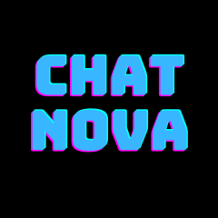
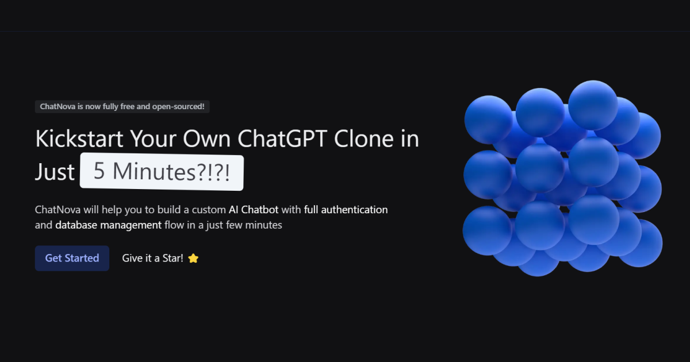

<div id="top"></div>

<!-- PROJECT LOGO -->
<br />
<div align="center">
  <a href="https://www.freecodecamp.org/">
    
  </a>

  <h2 align="center">
    Kickstart Your Own ChatGPT Clone in Just 5 Minutes
  </h2>

  <p align="center">
    Chat Nova will help you to build a custom AI Chatbot with full authentication and database management flow in a just few minutes
    <br />
    <a href="https://www.chatnova.co"><strong>What is Chat Nova »</strong></a>
    <br />
    <br />
    <a href="https://www.chatnova.co">View Demo</a>
    ·
    <a href="https://github.com/Kyler18/chat-nova/issues">Request Feature</a>
    ·
    <a href="https://github.com/Kyler18/chat-nova/issues">Report Bug</a>
  </p>

[](https://reactjs.org/)
[](https://nextjs.org/)
[](https://www.typescriptlang.org/)
[](https://supabase.io/)
[](https://tailwindcss.com/)
[](https://www.framer.com/api/motion/)


</div>

<div align="center">



</div>

## Introduction

Chat Nova is a full-stack chatbot that allows you to build a custom AI chatbot with full authentication and database management flow in a just few minutes. It is built with React, Next.js, TypeScript, Supabase, Tailwind CSS, and Framer Motion.

## Setup environment variables

1. Create `env.local` file inside the root directory of the project, and add the following environment variables:

   ```bash
   OPENAI_API_KEY= <YOUR API KEY HERE>
   NEXT_PUBLIC_SUPABASE_URL= <SUPABASE URL>
   NEXT_PUBLIC_SUPABASE_ANON_KEY= <ANON KEY>
   SUPABASE_SERVICE_KEY= <SERVICE KEY>
   ```
2. Generate a new OpenAI API key: [OpenAI Docs](https://help.openai.com/en/articles/4936850-where-do-i-find-my-secret-api-key).

3. Generate Supabase API keys, and service key: [Supabase Docs](https://supabase.com/docs/guides/getting-started/tutorials/with-nextjs#get-the-api-keys).

## Run Locally

To run this project in your local development environment, follow
these steps:

1. Clone the repository to your local machine.

   ```bash
   git@github.com:Kyler18/chat-nova.git
   ```

2. Open the cloned folder in your preferred code editor, install the required
   dependencies by running the following command in the terminal:

   ```bash
   npm install
   ```

3. Start the development server by running the following command:

   ```bash
   npm run dev
   ```

You are now ready to go!

## Contribute to this project

Thank you for browsing this repo. Any contributions you make are **greatly
appreciated**.

If you have a suggestion that would make this better, please fork the repo and
create a pull request. You can also simply open an issue with the tag
"enhancement". Don't forget to give the project a star! Thanks again!

1. Fork the Project
2. Create your Feature Branch (`git checkout -b feature/AmazingFeature`)
3. Commit your Changes (`git commit -m 'Add some AmazingFeature'`)
4. Push to the Branch (`git push origin feature/AmazingFeature`)
5. Open a Pull Request
